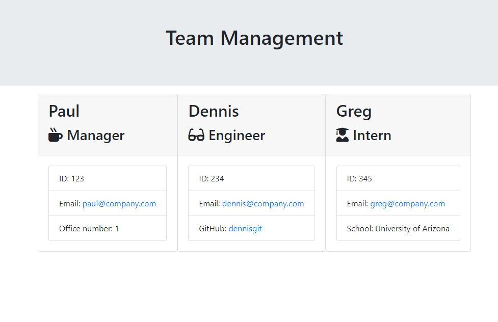

# Team Management App

This is a node application to create a webpage to help you manage a team of engineers and interns.

## Installation

The app should be installed by running `npm install` in the terminal to ensure all dependancies are installed.

## Usage

To use the tool, put `node app.js` into the terminal. The application will prompt you with questions in the terminal. Answer all questions until complete. Once completed, the application will generate a team.html into the output folder for your use.

